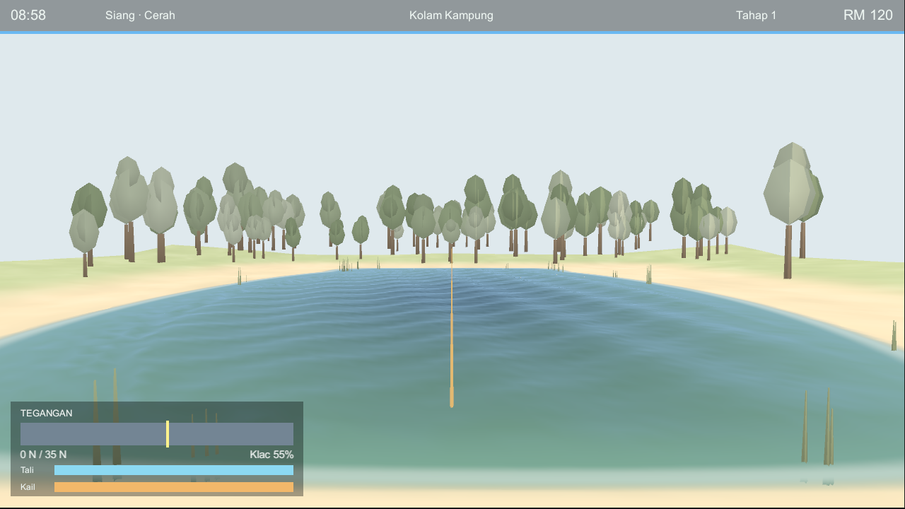
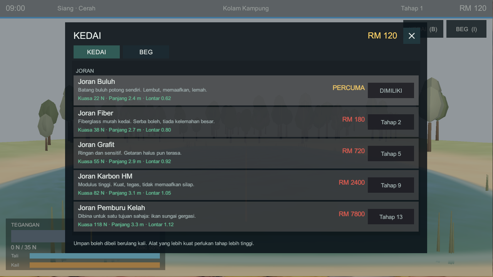
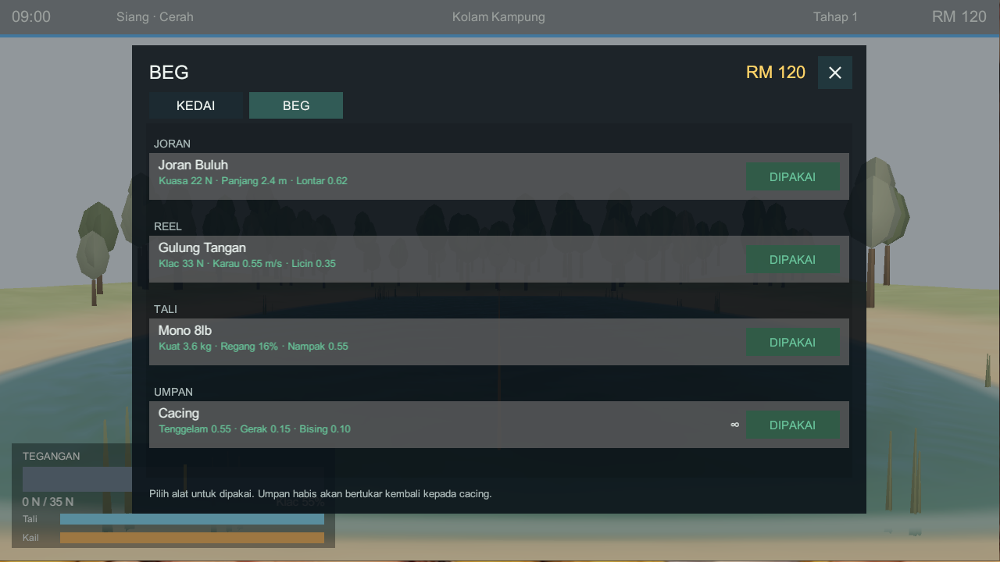

# Pancing

A physics-driven Malaysian freshwater fishing game in **Unity 6**, shipping as a
Windows `.exe` and an Android `.apk`.

```
Pancing/
  unity/Pancing/   the game — Unity 6000.3.18f1, Built-in render pipeline
  shared/          the data both sides read, and the harness that checks the port
  web/             the original Three.js build — now the GOLDEN REFERENCE, not a target
```



| the shop | the bag |
| --- | --- |
|  |  |

---

## Running it

Open `unity/Pancing` in Unity Hub and press **Play**. There is nothing to set up:
the game builds its own scene at runtime (see `GameLauncher`), so the project
contains one empty scene and no prefabs.

To build:

| menu item | output |
| --- | --- |
| `Pancing ▸ Build ▸ Windows (.exe)` | `Builds/Windows/Pancing.exe` |
| `Pancing ▸ Build ▸ Android (.apk)` | `Builds/Android/Pancing.apk` |
| `Pancing ▸ Build ▸ Both` | both |

Controls: **hold** Space / left mouse to charge a cast and release to throw ·
**Enter / E** to strike · **W** to reel · **A / D** to adjust the drag ·
**right-drag** to aim · **X** to reel in and start over · **B** for the shop,
**I** for the bag, **Esc** to close. On a phone the five fishing actions are
on-screen buttons, dragging the lower half of the screen aims, and the shop and
bag have their own buttons in the top-right corner.

Opening a panel pauses the world, and neither opens with a fish on the line —
equipping reconfigures the rod, reel and line underneath a live tension solve.

## Why the JavaScript build is still here

It was the first build, and it works. Rather than delete it, it is now the
**golden reference**: every system ported to C# is diffed against it, number for
number, before it counts as done.

```bash
bash shared/parity/run.sh
```

```
parity: using Unity 6000.5.0f1, runtime 8.0.21
parity: OK — 241 observations identical to 12 decimal places
```

That single command compiles the C# simulation with the Roslyn compiler **inside
the Unity editor** — no .NET SDK needed — runs the identical scripted scenario
through both engines, and diffs the output byte for byte. What it currently pins:

- the raw sfc32 integer stream, bit for bit, so one seed names one session;
- the FNV-1a hasher and the fork-label derivation;
- Box-Muller normals and the resampled clamped normal;
- the JSON data load: species allometry, depth bands, gear tables, and the
  **order** of each spot's species pool;
- `depthAt` sampled on a 5×5 grid per location, and the time-phase boundaries;
- the rod/line spring curves and the bisection solver across its range;
- a 900-tick fight on 30 lb braid — 2 % stretch, the case that explodes a naive
  ODE integrator — through drag slip, structure abrasion and two drag changes;
- three casts (perfect, early, backlash) through charge, release, ballistic
  flight, splashdown, sink and retrieve;
- the catch table's full weight list, **600 weighted draws**, and rolled fish
  with their length, mass, sigma, condition, value, XP and size class;
- a complete bite cycle — whiff, interest, commit, nibbles, window, hookset;
- 2 400 ticks of fight AI for four species, including state changes, hook shock
  and jump count.

Two independent implementations in two languages, agreeing to twelve decimals
across 254 lines. That is what makes it safe to keep tuning.

## Architecture

```
unity/Pancing/Assets/Pancing/
  Sim/         the simulation — plain C#, NO UnityEngine reference at all
    Core/      rng, json, math, event bus, vec3
    Data/      species, gear, spots  ← loaded from Resources/*.json
    Physics/   rod tension solver, bite FSM, cast ballistics
    Game/      catch table, fight AI, world clock, player state, the fishing loop
  Scripts/     the renderer — a pure consumer of simulation telemetry
    Core/      bootstrap, launcher, procedural noise
    Render/    water, environment, fish mesh synthesis, tackle, camera
    UI/        HUD
    Input/     keyboard, mouse and touch
  Resources/   three shaders and three JSON tables. No textures. No models.
  Editor/      one-click build tool
```

`Pancing.Sim.asmdef` sets **`noEngineReferences: true`**, so the simulation
*cannot* reference `UnityEngine` even by accident. That is what keeps it headless
— and it is what lets `shared/parity` compile those same files outside Unity and
diff them against Node.

Doubles throughout, `System.Math` and never `Mathf`: single precision does not
survive a twelve-decimal comparison.

## The three systems that matter

### Rod tension — `Sim/Physics/RodSystem.cs`

Rod tip and line are two springs in series between the reel and the fish. The
line is near-linear; the rod is deliberately not, because a real blank has a
progressive taper — soft at the tip, stiff at the butt:

```
e_rod(T) = maxDeflect · (1 − e^(−T / power))
```

That one curve is the shock absorber, and it is why a soft rod protects light
line and a broomstick snaps it. Both springs carry the same tension, so rather
than integrating a stiff ODE the solver **bisects for the tension directly** —
unconditionally stable at any timestep, about twenty float operations.

The drag is not a clamp. Above the clutch setting the spool slips and pays out
line, which drops the strain, which drops the tension back toward the setting.
The feedback loop *is* the drag. And the clutch is deliberately **not** limited
to the line's strength — a reel that can out-pull its line is exactly how anglers
break off. That is the central risk decision, and the HUD shows the clutch
setting on the same scale as the line's breaking force so it is legible.

### Bite detection — `Sim/Physics/BiteSystem.cs`

An attraction budget that fills or empties every tick according to whether what
you are doing matches what the fish down there wants. Presentation is scored from
four independent, multiplied factors — lure match, depth match, action match,
stealth — so one bad choice kills a bite outright. All four are on the HUD, which
is what makes a dead spot diagnosable rather than mysterious.

The hookset window is species-dependent: 320 ms for a Toman, 1.4 s for a prawn.

### The fight — `Sim/Game/HookedFish.cs`

The fish is an agent, not a health bar. Movement is pure force balance against
water drag: it swims away only while it out-pulls the line. Nothing in it knows
about the reel — reeling shortens the line, which raises tension, which flips the
sign of the net force. The tug of war is emergent.

Stamina drains against **the fish's own strength**, not the line's breaking
strain, so heavy tackle beats small fish quickly and still cannot bully a big one.

## Data

There are **no textures and no models**. Terrain, sky, trees, reeds, water,
fish meshes and catch-card portraits are all evaluated from seeded functions at
boot. A species is one record in `species.json`; the catch table, fight AI, bite
timing, 3D mesh and card art all pick it up with no other edits.

The tables are generated from the JavaScript reference so the two cannot drift:

```bash
node shared/tools/export-data.mjs
```

It writes `shared/data/*.json` and copies them into the Unity project's
`Resources/`. The one thing it cannot export is `spot.depthAt(u, v)` — a function,
not data. That lives as code in both engines (`SpotShapes.cs` and `spots.js`) and
the parity harness pins the two against each other.

## Status

| | state |
| --- | --- |
| Simulation ported to C# | ✅ complete, parity-verified |
| Data pipeline (JS → JSON → Unity) | ✅ complete |
| Water, terrain, sky, vegetation | ✅ working |
| Procedural fish meshes + catch card | ✅ working |
| HUD, touch controls, save/load | ✅ working |
| Windows build | ✅ 86 MB, runs clean |
| Android build | ✅ 35 MB `.apk`, IL2CPP, ARMv7 + ARM64 — **not yet run on a device** |
| Shop and bag panels | ✅ working |
| Audio | ⬜ none yet |
| Records / quests / travel panels | ⬜ backend done, no UI yet — so you cannot leave Kolam Kampung |
| Planar reflection | ⬜ shader keyword exists, not wired |
